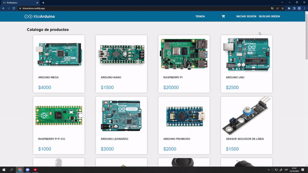
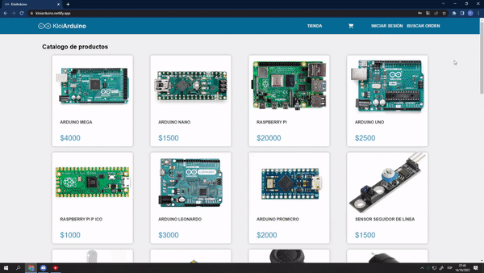
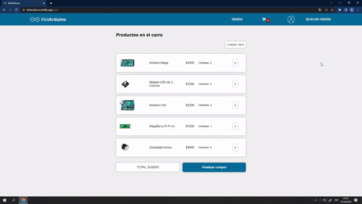
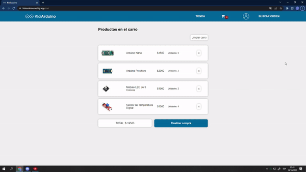
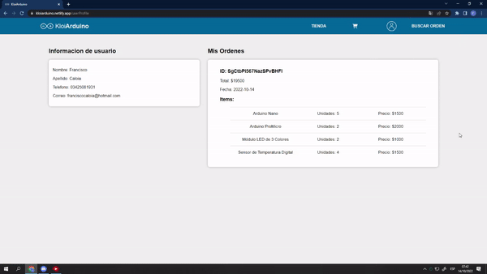

# Kloi**Arduino**

El proyecto simula un ecommerce en donde se muestran algunas de las placas que ofrece arduino y una serie de sensores para complementarlas. Se implementó autenticación utilizando Firebase auth y el guardado de los datos se realiza mediante Cloud Firestore. El cart es persistente gracias a que se almacena en el localStorage por lo que no se pierde al recargar la página. El Styling de la página fue realizado con la libreria StyledComponents.

### User  Story

**Barra de navegación:** es visible durante toda la experiencia de usuario. Esta contiene el logo de la página que actua como enlace a la pagina principal y el menú de navegación. El menú consta de 4 secciones de las cuales la primera consiste en el enlace a la lista completa de productos y cuenta con un submenú desplegable que permite navegar a las listas filtradas por categorías. En la segunda seccion se encuentra el icono del carro de compras que permite navegar a la pagina de checkout y tambien permite visualizar la cantidad de items presentes en el carro. La siguiente sección permite al usuario el inicio de sesión si es que no la ha iniciado, de haber iniciado sesión, la seccion permite acceder al perfil y a la función de "cerrar sesión" mediante un menú desplegable.  Finalmente se encuentra la sección de "buscar orden"  la cual permite al usuario navegar a la página de busqueda de ordenes. 

**Página principal:** permite acceder al detalle de cada producto, donde se muestra la descripción del producto y se da al usuario la opcion de agregar el mismo al carro. Una vez añadido el producto al carro, el usuario tiene la opción de proceder a finalizar la compra o volver al catálogo de productos. Al volver al catálogo se le informa al usuario los productos que ya se encuentran en el carro mediante un icono indicador. 

**Carro de compras:** es donde el usuario visualiza la lista de productos con sus precios y unidades así como tambien el total de la compra. Si el usuario hace click en el boton "Finalizar compra" y no se ha iniciado sesión se abre automaticamente el formulario de inicio de sesión. Si hay una sesión activa se muestra una advertencia para confirmar que el usuario desea realizar la compra con los datos de la sesión actual. Al confirmar se guarda la orden en una coleccion de Firestore que almacena los productos comprados, el total y la fecha de la compra y la informacion del usuario. Luego se le brinda al usuario el ID de su orden para que pueda buscarla en la pagina de busqueda de ordenes.

**Perfil de usuario:** solo esta disponible si hay una sesión activa y muestra la informacion personal del usuario y una lista con las ordenes asociadas al mismo.

**Busqueda de ordenes:** Muestra al usuario un input de texto que luego de recibir un ID de orden, muestra el detalle asociado al ID recibido. El detalle muestra información acerca de la fecha, los productos incluidos y el total de la compra, sin mostrar la información personal del usuario que la realizó.

A continuación brindo una serie de GIF's que muestran la experiencia de uso de la aplicación.

**Inicio de Sesión**

**Registro**

**Agregar productos al carro**

**Quitar productos del carro**

**Finalizar compra**

**Buscar orden**
